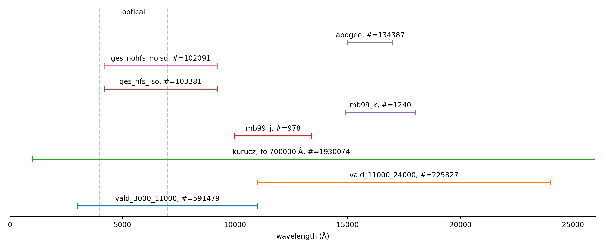

# Line lists

**Warning: the behavior of different line lists are not compared yet, so please use these line lists with caution.** 

`pymoog` provides several line lists as follow:

- GES line list (version 5.0) with hyperfine structure and isotopes: `ges_hfs_iso` (adopted from the software [iSpec](https://github.com/marblestation/iSpec))
    - This is the default line list if `line_list` is specified when initializing `synth`. 
    - No molecular line included.
- GES line list (version 5.0) without hyperfine structure and isotopes: `ges_nohfs_noiso` (adopted from the software [iSpec](https://github.com/marblestation/iSpec))
    - No molecular line included.
- VALD line list (February 2015) 300 to 11000 A: `vald_3000_11000` (adopted from the software [iSpec](https://github.com/marblestation/iSpec))
    - Molecular lines included.
- VALD line list (February 2015) 11000 to 24000 A: `vald_11000_24000` (adopted from the software [iSpec](https://github.com/marblestation/iSpec))
    - Molecular lines included.
- Meléndez & Barby line list in J-band: `mb99_j`(adopted from [Meléndez & Barbuy 1999](http://adsabs.harvard.edu/abs/1999ApJS..124..527M)) 
    - No molecular line included.
- Meléndez & Barby line list in K-band: `mb99_k`(adopted from [Meléndez & Barbuy 1999](http://adsabs.harvard.edu/abs/1999ApJS..124..527M)) 
    - No molecular line included.
- Kurucz line list: `kurucz` (adopted from [Kurucz website](http://kurucz.harvard.edu/linelists.html))
    - [gfall.dat](http://kurucz.harvard.edu/linelists/gfall/gfall.dat), modified in 2012.09.12 without hyperfine splitting.
    - No molecular line included.
- APOGEE line list: `apogee` (adopted from [Shetrone et al. 2015](https://ui.adsabs.harvard.edu/abs/2015ApJS..221...24S/abstract))
    - Molecular lines included.

MOOG seems cannot work with lines having excitation potential larger than 50 eV, so they are removed from the original line lists. 

The following figure shows the wavelength coverage of each line list.

